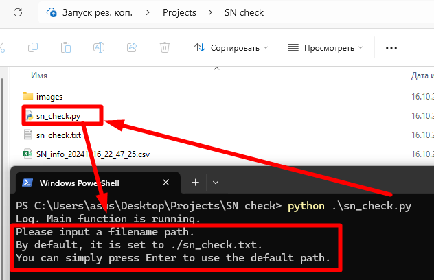
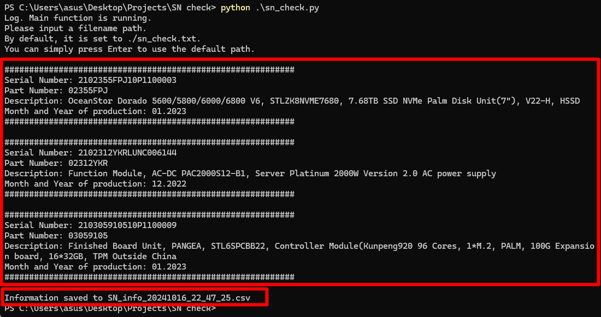
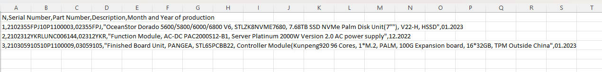

# Скрипт для анализа серийных номеров оборудования

## Описание проекта

Python-скрипт, разработанный для извлечения серийных номеров из текстового файла `sn_check.txt` (по умолчанию). Затем из каждого серийника извлекается информация о модели компонента и дате его производства.

Этот инструмент особенно полезен, когда необходимо понять причины массового выхода из строя деталей. 

Например, если замечено, что определенные компоненты часто выходят из строя, вы можете проверить дату их производства. Это поможет подтвердить теорию о фабричном браке в определенный период или выявить проблемы с условиями окружающей среды в машинном зале.

### Функциональность

#### Валидация серийных номеров:

- Проверяет корректность введенных серийных номеров по заданным критериям.
- Игнорирует неверные или некорректные серийные номера, продолжая обработку остальных.

#### Извлечение данных из серийных номеров:

- **Артикул (Part Number):** Извлекается из серийного номера (символы с 3 по 10).
- **Год и месяц производства:** Определяются по специальным кодам в серийном номере.
  - **Код года:** 13-й символ серийного номера.
  - **Код месяца:** 14-й символ серийного номера.
- **Описание товара:** Получается из внутренней базы данных на основе артикула.

- **Сохранение результатов:**
    - Обработанные данные сохраняются в текущей директории в CSV-файл.
    - Имя файла формируется на основе текущей даты и времени, например: `SN_info_20231017_14_45_00.csv`.

## Пример работы программы

- **Запуск скрипта**  
  
 
- **Вывод в консоли:**
  
- **Содержимое CSV-файла:**
   
